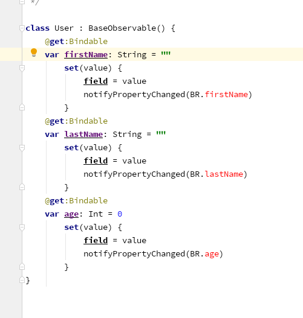
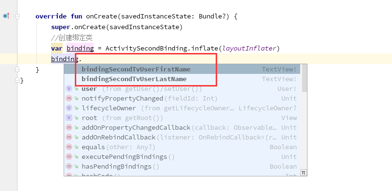

# data-binding 数据绑定库

> 奉上 Google 的官方文档地址： [数据绑定库]( https://developer.android.google.cn/topic/libraries/data-binding )


<br/>
数据绑定库可以在布局文件里使用声明性格式绑定数据源到界面视图上。
简化了之前的需要在 Activity 里 `findViewById()` 找到视图，然后再设置数据。

另外，数据绑定库可以单向绑定，双向绑定，实现数据驱动，事件驱动。


databinding 不需要声明依赖，是和 android studio捆绑在一起的，加入下面的 DSL 配置即可

```groovy
android{
    dataBinding {
            enabled = true
     }
}
```

##  布局和绑定表达式

 表达式语言可以编写处理由视图调度的事件的表达式。数据绑定库会自动生成布局中的视图与数据对象绑定所需的类。


 数据绑定布局文件和平常的布局文件略有不同，它们以 `layout` 的根标签开始，后跟一个 `data` 元素和一个视图根元素。 此视图元素就是你平常布局中的根元素。  以下代码显示了一个示例布局文件：

```xml
<?xml version="1.0" encoding="utf-8"?>
<layout xmlns:android="http://schemas.android.com/apk/res/android">
   <data>
       <variable name="user" type="com.example.User"/>
   </data>
   <LinearLayout
       android:orientation="vertical"
       android:layout_width="match_parent"
       android:layout_height="match_parent">
       <TextView android:layout_width="wrap_content"
           android:layout_height="wrap_content"
           android:text="@{user.firstName}"/>
       <TextView android:layout_width="wrap_content"
           android:layout_height="wrap_content"
           android:text="@{user.lastName}"/>
   </LinearLayout>
</layout>
```


 `data` 中的 `user` 变量描述了可以在此布局中使用的属性。

```xml
<variable name="user" type="com.example.User" />
```

 使用 `@ {}` 语法将布局内的表达式写入属性中。  在这里，`TextView` 文本设置为 `user` 变量的 `firstName` 属性：

```xml
<TextView android:layout_width="wrap_content"
          android:layout_height="wrap_content"
          android:text="@{user.firstName}" />
```


> **注意：**  布局表达式应保持简单，因为它们不能进行单元测试并且对 IDE 的支持有限。为了简化布局表达，可以使用自定义绑定适配器（下面有解释）。


### 数据对象

普通对象就可以，例如一个用户实体

Kotlin
```kotlin
data class User(val firstName: String, val lastName: String)
```
Java
```java
public class User {
  public final String firstName;
  public final String lastName;
  public User(String firstName, String lastName) {
      this.firstName = firstName;
      this.lastName = lastName;
  }
}
```
这种类型的对象具有永不更改的数据，在程序中，通常只读取一次数据，此后再也不会更改。也可以使用遵循一组约定的对象，例如 Java 中访问器方法的用法，如以下示例所示：


```java
public class User {
  private final String firstName;
  private final String lastName;
  public User(String firstName, String lastName) {
      this.firstName = firstName;
      this.lastName = lastName;
  }
  public String getFirstName() {
      return this.firstName;
  }
  public String getLastName() {
      return this.lastName;
  }
}

```
从数据绑定的角度来看，这两个类是等效的。`android：text` 属性的表达式 `@ {user.firstName}` 用于访问前一类中的 `firstName` 字段和后一类中的 `getFirstName()` 方法。或者，如果该方法存在，它也解析为 `firstName()`。


### 绑定对象

为每个布局文件生成一个绑定类。默认情况下，类的名称基于布局文件的名称，将其转换为 Pascal 大小写并向其添加 Binding 后缀。上面的布局文件名是 `activity_main.xml` ，因此相应的生成类是 `ActivityMainBinding` 。此类包含从布局属性（例如，用户变量）到布局视图的所有绑定，并且知道如何为绑定表达式分配值。建议创建绑定类对象的方法是在加载布局的同时进行绑定，如以下示例所示：

Kotlin
```kotlin
override fun onCreate(savedInstanceState: Bundle?) {
    super.onCreate(savedInstanceState)

    val binding: ActivityMainBinding = DataBindingUtil.setContentView(
            this, R.layout.activity_main)

    binding.user = User("Test", "User")
}

```

Java
```java
@Override
protected void onCreate(Bundle savedInstanceState) {
   super.onCreate(savedInstanceState);
   ActivityMainBinding binding = DataBindingUtil.setContentView(this, R.layout.activity_main);
   User user = new User("Test", "User");
   binding.setUser(user);
}

```

在运行时，该应用在 UI 中显示 “Test” 用户。或者，可以使用 `LayoutInflater` 获取视图，如以下示例所示：
Kotlin

```kotlin
val binding: ActivityMainBinding = ActivityMainBinding.inflate(getLayoutInflater())

```
Java
```java
ActivityMainBinding binding = ActivityMainBinding.inflate(getLayoutInflater());

```
如果在 Fragment，ListView 或 RecyclerView 适配器中使用数据绑定项，则可能更喜欢使用绑定类或 DataBindingUtil 类的 inflate() 方法，如以下代码示例所示：

Kotlin
```kotlin
val listItemBinding = ListItemBinding.inflate(layoutInflater, viewGroup, false)
// or
val listItemBinding = DataBindingUtil.inflate(layoutInflater, R.layout.list_item, viewGroup, false)

```

Java
```java
ListItemBinding binding = ListItemBinding.inflate(layoutInflater, viewGroup, false);
// or
ListItemBinding binding = DataBindingUtil.inflate(layoutInflater, R.layout.list_item, viewGroup, false);

```

### 表达式语言

#### 共同点

表达式语言和代码里的表达式看起来很像。可以在表达式语言中使用以下运算符和关键字：

- 数学 `+ - / * %`
- 字符级联 `+`
- 逻辑 `&& ||`
- 二元 `& | ^`
- 一元 `+ - ! ~`
- 位移 `>> >>> <<`
- 比较 `== > < >= <=` (< 需要转义：`&lt;`)
- instanceof
- 分组 ()
- 文字  字符，字符串，数值，null
- 转换
- 方法调用
- 字段访问
- 数组访问 `[]`
- 三元符 `?:`

例如：
```xml
android:text="@{String.valueOf(index + 1)}"
android:visibility="@{age > 13 ? View.GONE : View.VISIBLE}"
android:transitionName='@{"image_" + id}'
```

#### 不能使用的操作符

- this
- super
- new
- 显式泛型调用

#### 空合并运算符

空合并操作符（`??`）如果不为空，则选择左边；如果前一个为空，则选择右边。

```xml
android:text="@{user.displayName ?? user.lastName}"
```
在功能上等效于：
```xml
android:text="@{user.displayName != null ? user.displayName : user.lastName}"
```

#### 属性引用

表达式可以使用以下格式来引用类中的属性，对于字段，`getter` 和 `ObservableField` 对象是相同的：
```xml
android:text="@{user.lastName}"
```

#### 避免空指针异常

生成的数据绑定代码自动检查空值，并避免空指针异常。例如，在表达式 `@ {user.name}` 中，如果 `user` 为 `null` ，则为 `user.name` 分配其默认值 `null` 。如果引用 `user.age` ，`age` 是 `int` 类型，则数据绑定将使用默认值 0。

#### 集合

为了方便起见，可以使用 `[]` 运算符访问常见的集合，例如数组，列表，稀疏列表和字典。

```xml
<data>
    <import type="android.util.SparseArray"/>
    <import type="java.util.Map"/>
    <import type="java.util.List"/>
    <variable name="list" type="List&lt;String>"/>
    <variable name="sparse" type="SparseArray&lt;String>"/>
    <variable name="map" type="Map&lt;String, String>"/>
    <variable name="index" type="int"/>
    <variable name="key" type="String"/>
</data>
…
android:text="@{list[index]}"
…
android:text="@{sparse[index]}"
…
android:text="@{map[key]}"
```

> **注意：**  为了使XML在语法上正确，必须对<字符进行转义。例如：您必须编写 `List &lt;String>` 而不是List <String>。


还可以使用 `object.key` 表示法引用映射中的值。例如，以上示例中的 `@ {map [key]}` 可以替换为 `@ {map.key}` 。


#### 字符串文字

可以使用单引号将属性值引起来，这允许在表达式中使用双引号，如以下示例所示：

```xml
android:text='@{map["firstName"]}'
```
也可以使用双引号将属性值引起来。这样做时，字符串文字应该用反引号 ` 引起来：

```xml
android:text="@{map[`firstName`]}"
```

#### 资源
可以使用以下语法访问表达式中的资源：

```xml
android:padding="@{@dimen/smallPadding}"
```

格式字符串和复数形式可以通过提供参数来计算：

```xml
android:text="@{@string/nameFormat(firstName, lastName)}"
android:text="@{@plurals/banana(bananaCount)}"
```

当复数带有多个参数时，应传递所有参数：

```xml

  Have an orange
  Have %d oranges

android:text="@{@plurals/orange(orangeCount, orangeCount)}"
```

某些资源需要显式类型，如下表所示：

| 类型              | 普通引用  | 表达式引用         |
| ----------------- | --------- | ------------------ |
| String[]          | @array    | @stringArray       |
| int[]             | @array    | @intArray          |
| TypedArray        | @array    | @typedArray        |
| Animator          | @animator | @animator          |
| StateListAnimator | @animator | @stateListAnimator |
| color int         | @color    | @color             |
| ColorStateList    | @color    | @colorStateList    |


### 事件绑定


数据绑定库 是可以通过写表达式的方式处理分发事件的。

事件属性的名字就是 Listener 里的方法名字，

例如 View.OnClickListener 里的方法名是 onClick(),

那么对应的 View 的属性名字就应该是 android:onClick.


很多监听里的方法都是 onClick() ，那么就会出现冲突，为了避免冲突。

可以使用下面这个规则去用事件属性以避免冲突：

| 类           | 监听 设置方法                                   | 事件属性              |
| ------------ | ----------------------------------------------- | --------------------- |
| SearchView   | setOnSearchClickListener(View.OnClickListener)  | android:onSearchClick |
| ZoomControls | setOnZoomInClickListener(View.OnClickListener)  | android:onZoomIn      |
| ZoomControls | setOnZoomOutClickListener(View.OnClickListener) | android:onZoomOut     |

你可以使用以下机制来处理事件：

- 方法引用

  ​    在你的表达式里，你可以引用符合监听方法签名的方法。当表达式对方法引用求值时，数据绑定库会包装一个方法引用和这个方法引用所属的对象到一个监听里，然后将这个监听设置到目标 View 。如果表达式的结果是 null ，数据绑定库就不会创建监听器并设置一个 null 替换监听器。

- 监听绑定

  ​    这些是当事件发生时被求值的 lambda 表达式。数据绑定库 总是会创建一个监听器，并设置给目标 View 。当事件分发，数据绑定库 就会执行 lambda 表达式。

#### 方法引用

事件可以直接被绑定到处理方法上，例如 onClick 点击事件可以直接绑定到 Activity 的 onClick() 方法上。这样有一个好处就是，View 的 onClick 属性表达式是在编译时被计算的，如果方法不存在或者方法签名不对，编译器会直接报错。


方法引用和监听绑定的主要区别是实际监听器的创建时机，方法引用是在数据绑定时创建的监听器而不是事件触发时。如果你倾向于在事件发生时执行表达式，可以使用监听绑定。

发送一个事件到它的处理器，使用普通的绑定表达式即可，值是处理器的方法名字。

例如，处理一个 Button 的点击事件，处理器是 Activity 。


1. 处理器 MainActivity.kt

   ```kotlin
       fun onClick(view: View) {
           Log.e(this.localClassName, "更改 index")
           binding.index = 1
       }

   ```


2. 事件绑定

   ```xml
   <layout>
       <data>
   		·······
            <!-- 声明事件处理器-->
           <variable
                     name="eventsHandler"
                     type="com.github.skymxc.MainActivity" />

           ······
       </data>
       <androidx.constraintlayout.widget.ConstraintLayout>

           ······
           <!--- 使用 android:onClick="@{eventsHandler::onClick}" 绑定处理器里的方法-->
           <Button
               android:id="@+id/binding_btn_update_index"
               android:layout_width="wrap_content"
               android:layout_height="wrap_content"
               android:layout_margin="@dimen/binding_margin"
               android:onClick="@{eventsHandler::onClick}"
               android:text="update index "
               android:textAllCaps="false"
               app:layout_constraintLeft_toLeftOf="parent"
               app:layout_constraintTop_toBottomOf="@id/binding_tv_string" />

           ······
       </androidx.constraintlayout.widget.ConstraintLayout>

   </layout>

   ```


如果事件属性的表达式里的方法不存在或者方法签名不正确在编译时就会给出错误信息：

```xml
* What went wrong:
Execution failed for task ':databinding:compileDebugJavaWithJavac'.
> android.databinding.tool.util.LoggedErrorException: Found data binding errors.
  ****/ data binding error ****msg:Listener class android.view.View.OnTouchListener with method onTouch did not match signature of any method eventsHandler::onTouch
  file:D:\Demo\Example\databinding\src\main\res\layout\activity_main.xml
  loc:140:31 - 140:52
  ****\ data binding error ****

```


#### 监听绑定


监听绑定是 当事件发生时被运行的绑定表达式。类似于方法引用，但是可以运行任意的数据表达式。这个特征在 Android Gradle 插进 的 2.0 版本之后可以使用。

在方法引用里，方法的参数是必须和事件监听里的参数匹配的，而在监听绑定则不然，只是返回值必须和监听匹配（除非返回 void）。

例如：Presenter 里有一个 `onSaveClick()` 方法
```kotlin
class Presenter {
    fun onSaveClick(task: Task){}
}
```

绑定点击事件到 `onSaveClick()`

```xml
<?xml version="1.0" encoding="utf-8"?>
<layout xmlns:android="http://schemas.android.com/apk/res/android">
    <data>
        <variable name="task" type="com.android.example.Task" />
        <variable name="presenter" type="com.android.example.Presenter" />
    </data>
    <LinearLayout android:layout_width="match_parent" android:layout_height="match_parent">
        <Button android:layout_width="wrap_content" android:layout_height="wrap_content"
        android:onClick="@{() -> presenter.onSaveClick(task)}" />
    </LinearLayout>
</layout>
```

当在表达式里使用回调时，数据绑定库会自动创建这个必须的监听并为它注册事件。
当事件被触发，数据绑定库会计算给定的表达式。像在常规绑定表达式中一样，在计算这些监听器表达式时，你仍然可以获得数据绑定的 null 和线程安全。

在上面的示例中并没有传递 `onClick(View)` 的 view 参数。监听绑定对监听参数有两种选择：要么忽略全部要么全部命名。

如果你想命名全部参数，你可以在表达式里使用这些参数。例如

```xml
android:onClick="@{(view) -> presenter.onSaveClick(task)}"
```

或者，如果你想在表达式使用参数


```kotlin
class Presenter {
    fun onSaveClick(view: View, task: Task){}
}
```


```xml
android:onClick="@{(theView) -> presenter.onSaveClick(theView, task)}"
```

也可以使用多个参数的 lambda 表达式


```ko
class Presenter {
    fun onCompletedChanged(task: Task, completed: Boolean){}
}
```


```xml
<CheckBox android:layout_width="wrap_content"
          android:layout_height="wrap_content"
          android:onCheckedChanged="@{(cb, isChecked) -> presenter.completeChanged(task, isChecked)}" />
```


如果你的事件监听的返回值不是 void ，那么你必须返回相同类型的返回值。

例如，你要监听长按事件，你的表达式必须返回一个布尔值。

```kotlin
class Presenter {
    fun onLongClick(view: View, task: Task): Boolean { }
}
```

```xml
android:onLongClick="@{(theView) -> presenter.onLongClick(theView, task)}"
```


如果由于空对象的原因不能对表达式求值，数据绑定库会返回这个类型的默认值。

例如，引用类型返回 null，int 返回 0，布尔值返回 false ，等等。


##### 避免复杂监听

监听表达式是强大且易读的。如果监听包含很复杂的表达式会让布局难以阅读和维护。

这些表达式应该尽可能的简单到将可用的数据从UI传递到回调方法，将商业逻辑在表达式调用的回调的方法里实现。

### 导入，变量，包含

数据绑定库支持 导入，变量和包含。

导入让你在布局文件里很轻易的使用引用类型。

变量可以让你在表达式里使用属性。

包含可以重用复杂的布局逻辑。


#### 导入


使用导入可以很轻易的在布局里引用类型，就像在代码里一样。可以在 data 元素里声明多个 `import` 元素用于导入类型。例如导入 `View` 类

```xml
<data>
    <import type="android.view.View"/>
</data>
```

导入 `View` 之后，就可以在表达式里引用它了，例如使用 `View` 类的 `VISIBLE` 和 `GONE` 常量。

```xml
<TextView
   android:text="@{user.lastName}"
   android:layout_width="wrap_content"
   android:layout_height="wrap_content"
   android:visibility="@{user.isAdult ? View.VISIBLE : View.GONE}"/>
```


##### 类型别名


当多个类名出现重复的时候，可以通过给命名别名的方式解决冲突。

```xml
<import type="android.view.View"/>
<import type="com.example.real.estate.View"
        alias="Vista"/>
```

在布局文件中可以使用 `Vista` 引用到 `com.example.real.estate.View` .

##### 导入其他类型


导入类型可以在变量和表达式里做类型引用。下面是 User 和 List 被用作变量类型

```xml
<data>
    <import type="com.example.User"/>
    <import type="java.util.List"/>
    <variable name="user" type="User"/>
    <variable name="userList" type="List&lt;User>"/>
</data>
```

在表达式也可以使用导入的引用类型做强制转换。

```xml
<TextView
   android:text="@{((User)(user.connection)).lastName}"
   android:layout_width="wrap_content"
   android:layout_height="wrap_content"/>
```

 当在表达式中引用静态字段和方法时，也可以使用导入的类型。  以下代码导入`MyStringUtils` 类并引用其大写方法：

```xml
<data>
    <import type="com.example.MyStringUtils"/>
    <variable name="user" type="com.example.User"/>
</data>
…
<TextView
   android:text="@{MyStringUtils.capitalize(user.lastName)}"
   android:layout_width="wrap_content"
   android:layout_height="wrap_content"/>
```

和代码里一样，java.lang.* 是被默认导入的。

#### 变量


可以在 `data` 元素里使用多个 `variable` 元素。每一个  `variable`  表示一个属性，每个  `variable` 元素描述一个可以在布局上设置的属性，以在布局文件内的绑定表达式中使用。

```xml
<data>
    <import type="android.graphics.drawable.Drawable"/>
    <variable name="user" type="com.example.User"/>
    <variable name="image" type="Drawable"/>
    <variable name="note" type="String"/>
</data>
```

 在编译时检查变量类型，因此，如果变量实现 `Observable` 或是 `Observable` 集合，则应在类型中反映出来。

 如果变量是未实现 `Observable` 接口的基类或接口，则不会观察到变量。


 当针对各种配置（例如，横向或纵向）有不同的布局文件时，将合并变量。这些布局文件之间不得有冲突的变量定义。


每一个声明的变量绑定类都会生成对应的  `getter`  和 `setter` ,在 `setter` 被调用前，变量是有默认值的，引用类型是 null，int 是 0, 布尔是 false 等等的。

会根据需要生成一个特殊的名为 `context` 的变量，用于绑定表达式。 `context` 的值是根视图的 `getContext（）` 方法中的 `Context` 对象。上下文变量被具有该名称的显式变量声明覆盖。


#### 包含


 通过使用 `app` 名称空间和属性中的变量名称，可以将变量从包含的布局传递到被包含布局的绑定中。

 这里做个示范：

```xml
<?xml version="1.0" encoding="utf-8"?>
<layout xmlns:android="http://schemas.android.com/apk/res/android"
    xmlns:app="http://schemas.android.com/apk/res-auto"
    xmlns:bind="http://schemas.android.com/apk/res-auto"
    xmlns:tools="http://schemas.android.com/tools"
    tools:context=".MainActivity">

    <data>
        <variable
            name="string"
            type="String" />

        <variable
            name="banner"
            type="com.github.skymxc.entity.Banner" />

    </data>

    <androidx.constraintlayout.widget.ConstraintLayout
        android:layout_width="match_parent"
        android:layout_height="match_parent">

        <include layout="@layout/layout_banner"
            bind:banner="@{banner}"
            app:layout_constraintLeft_toLeftOf="parent"
            app:layout_constraintTop_toTopOf="parent"
            android:layout_width="wrap_content"
            android:layout_height="wrap_content"
            android:id="@+id/banner_desc"/>

    </androidx.constraintlayout.widget.ConstraintLayout>

</layout>
```


这个布局文件几个重点：

- `layout` 有个新属性 `xmlns:bind="http://schemas.android.com/apk/res-auto"` 这对稍后使用 `bind:banner` 是必须的。
- `data` 包含的变量名字和类型引用会被传递到包含的布局。
- `include` 有个新属性 `bind:banner="@{banner}"` 这是告诉被包含的布局，主布局将会传递一个名字叫 `banner` 的变量给它，并且它将会映射到被包含布局的名为 `banner` 的变量。

被包含的布局：

```xml
<?xml version="1.0" encoding="utf-8"?>
<layout xmlns:android="http://schemas.android.com/apk/res/android">

    <data>

        <variable
            name="banner"
            type="com.github.skymxc.entity.Banner" />
    </data>

    <LinearLayout
        android:layout_width="wrap_content"
        android:layout_height="wrap_content"
        android:orientation="vertical">

        <TextView
            android:layout_width="wrap_content"
            android:layout_height="wrap_content"
            android:layout_margin="@dimen/binding_margin"
            android:text="@{String.valueOf(banner.id)}" />

        <TextView
            android:layout_width="wrap_content"
            android:layout_height="wrap_content"
            android:layout_margin="@dimen/binding_margin"
            android:text="@{banner.title}" />


        <TextView
            android:layout_width="wrap_content"
            android:layout_height="wrap_content"
            android:layout_margin="@dimen/binding_margin"
            android:text="@{banner.desc}" />

    </LinearLayout>

</layout>
```


划重点：

- `data` 下的 `variable` 有一个和从主布局传递过来的数据相同的名字 `banner` 并且变量类型也是一样的。这个变量就是传递过来的变量了。


databinding 不支持包含作为 `merge` 元素的直接子级。

例如，不支持以下布局：

```xml
<?xml version="1.0" encoding="utf-8"?>
<layout xmlns:android="http://schemas.android.com/apk/res/android"
        xmlns:bind="http://schemas.android.com/apk/res-auto">
   <data>
       <variable name="user" type="com.example.User"/>
   </data>
   <merge><!-- Doesn't work -->
       <include layout="@layout/name"
           bind:user="@{user}"/>
       <include layout="@layout/contact"
           bind:user="@{user}"/>
   </merge>
</layout>
```


参考资料：

[include 传递变量的参考链接]( https://medium.com/@elia.maracani/android-data-binding-passing-a-variable-to-an-include-d-layout-3567099b58f )


## 使用可观察的数据对象


可观察性是指对象将其数据改变通知其他人的能力。数据绑定库可以让你的对象，字段或集合具有可观察性。


任何普通对象都可以被用于数据绑定，但更改这个对象不会自动更新 UI。数据绑定可用于使你的数据对象在数据更改时通知其他对象（称为侦听器）。 有三种不同类型的可观察类：对象，字段和集合。


 这些可观察数据对象之一绑定到UI且数据对象的属性更改时，UI将自动更新。


### 可观察字段

如果你的类仅具有少许可观察属性，实现 `Observable` 接口明细是不值当的。在这种情况下，可以使用通用的 `Observable` 类和以下特定于原始的类来使属性可观察：

- [ObservableBoolean](https://developer.android.google.cn/reference/androidx/databinding/ObservableBoolean.html)
- [ObservableByte](https://developer.android.google.cn/reference/androidx/databinding/ObservableByte.html)
- [ObservableChar](https://developer.android.google.cn/reference/androidx/databinding/ObservableChar.html)
- [ObservableShort](https://developer.android.google.cn/reference/androidx/databinding/ObservableShort.html)
- [ObservableInt](https://developer.android.google.cn/reference/androidx/databinding/ObservableInt.html)
- [ObservableLong](https://developer.android.google.cn/reference/androidx/databinding/ObservableLong.html)
- [ObservableFloat](https://developer.android.google.cn/reference/androidx/databinding/ObservableFloat.html)
- [ObservableDouble](https://developer.android.google.cn/reference/androidx/databinding/ObservableDouble.html)
- [ObservableParcelable](https://developer.android.google.cn/reference/androidx/databinding/ObservableParcelable.html)

 可观察字段是具有单个字段的自包含可观察对象。原始版本避免在访问操作期间装箱和拆箱。要使用此机制，请使用Java编程语言创建一个public final属性，或者使用Kotlin创建一个只读属性，如以下示例所示：

Kotlin

```kotlin
class User {
    val firstName = ObservableField<String>()
    val lastName = ObservableField<String>()
    val age = ObservableInt()
}

```


Java

```java
private static class User {
    public final ObservableField<String> firstName = new ObservableField<>();
    public final ObservableField<String> lastName = new ObservableField<>();
    public final ObservableInt age = new ObservableInt();
}

```

 要访问该字段值，请使用 `set()` 和 `get()` 访问器方法，如下所示：

Kotlin

```kotlin
user.firstName = "Google"
val age = user.age
```

Java

```java
user.firstName.set("Google");
int age = user.age.get();
```


> **注意：**  Android Studio 3.1及更高版本允许你用LiveData对象替换可观察字段，这为您的应用程序提供了更多好处。有关更多信息，请参见 [使用LiveData通知UI有关数据更改。](https://developer.android.google.cn/topic/libraries/data-binding/architecture.html#livedata)


### 可观察集合

这里使用 `ObservableMap` 和 `ObservableList` 做示例：

**ObservableMap**

Kotlin
```kotlin
ObservableArrayMap<String, Any>().apply {
    put("firstName", "Google")
    put("lastName", "Inc.")
    put("age", 17)
}
```

Java
```java
ObservableArrayMap<String, Object> user = new ObservableArrayMap<>();
user.put("firstName", "Google");
user.put("lastName", "Inc.");
user.put("age", 17);

```

布局中
```xml
<data>
    <import type="android.databinding.ObservableMap"/>
    <variable name="user" type="ObservableMap&lt;String, Object>"/>
</data>
…
<TextView
    android:text="@{user.lastName}"
    android:layout_width="wrap_content"
    android:layout_height="wrap_content"/>
<TextView
    android:text="@{String.valueOf(1 + (Integer)user.age)}"
    android:layout_width="wrap_content"
    android:layout_height="wrap_content"/>
```

**ObservableList**

Kotlin
```kotlin
ObservableArrayList<Any>().apply {
    add("Google")
    add("Inc.")
    add(17)
}
```

Java
```java
ObservableArrayList<Object> user = new ObservableArrayList<>();
user.add("Google");
user.add("Inc.");
user.add(17);
```

布局中
```xml
<data>
    <import type="android.databinding.ObservableList"/>
    <import type="com.example.my.app.Fields"/>
    <variable name="user" type="ObservableList&lt;Object>"/>
</data>
…
<TextView
    android:text='@{user[Fields.LAST_NAME]}'
    android:layout_width="wrap_content"
    android:layout_height="wrap_content"/>
<TextView
    android:text='@{String.valueOf(1 + (Integer)user[Fields.AGE])}'
    android:layout_width="wrap_content"
    android:layout_height="wrap_content"/>
```

### 可观察对象

 实现 `Observable` 接口的类允许注册要在可观察对象上进行属性更改通知的监听。

这个 `Obserable` 接口有个可以添加和移除监听的机制，但是你必须确定什么时候发送通知。为了简化开发，数据绑定库提供了 `BaseObservable` 类，它已经实现了监听注册机制。我们只需要实现在属性数据更改时发送通知就好。这个是在 getter 访问器上分配一个 `Bindable` 注解，以及在 setter 上通过 `notifyPropertyChanged()` 方法实现的，如下所示：

Kotlin

```kotlin
class User : BaseObservable() {

    @get:Bindable
    var firstName: String = ""
        set(value) {
            field = value
            notifyPropertyChanged(BR.firstName)
        }

    @get:Bindable
    var lastName: String = ""
        set(value) {
            field = value
            notifyPropertyChanged(BR.lastName)
        }
}
```


Java

```java
private static class User extends BaseObservable {
    private String firstName;
    private String lastName;

    @Bindable
    public String getFirstName() {
        return this.firstName;
    }

    @Bindable
    public String getLastName() {
        return this.lastName;
    }

    public void setFirstName(String firstName) {
        this.firstName = firstName;
        notifyPropertyChanged(BR.firstName);
    }

    public void setLastName(String lastName) {
        this.lastName = lastName;
        notifyPropertyChanged(BR.lastName);
    }
}

```


会产生一个 BR 类，这类含有数据绑定使用到的资源 ID。 Bindable注释在编译期间会在BR类文件中生成一个入口。



如果不能更改数据类的基类，则可以使用PropertyChangeRegistry对象来实现Observable接口，以高效地注册和通知侦听器。


### 遇到的问题

databinding Unresolved reference: BR

使用可观察对象时出的问题。解决办法在 stackoverflow 找到了。[传送门]( https://stackoverflow.com/questions/50956111/unresolved-reference-br-android-studio )

解决办法是添加了一个插件,这里以我的举例

project  build.gradle

```groovy
buildscript {
    ext.kotlin_version = '1.3.50'
    ext.compiler_version  = '3.4.0'


    repositories {
        mavenCentral()
        google()
        jcenter()

    }
    dependencies {
        classpath "com.android.tools.build:gradle:$compiler_version"


        // NOTE: Do not place your application dependencies here; they belong
        // in the individual module build.gradle files
    classpath "org.jetbrains.kotlin:kotlin-gradle-plugin:$kotlin_version" }
}
```


app build.gradle

```groovy
apply plugin: 'kotlin-kapt'
kapt {
    generateStubs = true
}
dependencies {
    kapt "com.android.databinding:compiler:$compiler_version"
}
```


## 生成绑定类

数据绑定库会生成一个绑定类，可以使用这个绑定类访问布局里的视图和变量。

生成的这个绑定类连接布局变量和视图。绑定类的包和名字都可以自定义。所有的绑定类都继承自 [ViewDataBinding](https://developer.android.google.cn/reference/androidx/databinding/ViewDataBinding.html)

每个布局文件都会生成一个绑定类，默认的名字是布局文件名转换为帕斯卡命名并增加后缀 `Binding` .

例如 `activity_main.xml` 生成的绑定类就是 `ActivityMainBinding` 。  此类包含从布局属性（例如，变量）到布局视图的所有绑定，并且知道如何为绑定表达式分配值。


### 创建绑定对象

绑定对象应该在加载布局后马上创建，以确保视图结构在绑定视图表达式之前不被更改。 将对象绑定到布局的最常见方法是使用绑定类上的静态方法。 可以使用绑定类的 `inflate()`  方法来加载视图层次结构并将对象绑定到该视图结构，如以下示例所示：


Kotlin

```kotlin
override fun onCreate(savedInstanceState: Bundle?) {
    super.onCreate(savedInstanceState)

    val binding: MyLayoutBinding = MyLayoutBinding.inflate(layoutInflater)
}

```

Java

```java
@Override
protected void onCreate(Bundle savedInstanceState) {
    super.onCreate(savedInstanceState);
    MyLayoutBinding binding = MyLayoutBinding.inflate(getLayoutInflater());
}

```


另外，有 `ViewGroup`  时还可以使用这个方法：

Kotlin

```kotlin
val binding: MyLayoutBinding = MyLayoutBinding.inflate(getLayoutInflater(), viewGroup, false)

```

Java

```java
MyLayoutBinding binding = MyLayoutBinding.inflate(getLayoutInflater(), viewGroup, false);

```

如果你试用别的方法加载了布局，还可以使用这个方法：


Kotlin

```kotlin
val binding: MyLayoutBinding = MyLayoutBinding.bind(viewRoot)

```

Java

```java
MyLayoutBinding binding = MyLayoutBinding.bind(viewRoot);

```

如果你之前并不知道绑定类的类型，这是你可以使用 `DataBindingUtil` 类

Kotlin

```kotlin
val viewRoot = LayoutInflater.from(this).inflate(layoutId, parent, attachToParent)
val binding: ViewDataBinding? = DataBindingUtil.bind(viewRoot)

```

Java

```java
View viewRoot = LayoutInflater.from(this).inflate(layoutId, parent, attachToParent);
ViewDataBinding binding = DataBindingUtil.bind(viewRoot);

```


建议是在设置布局时同时创建绑定类：

Kotlin

```kotlin
override fun onCreate(savedInstanceState: Bundle?) {
    super.onCreate(savedInstanceState)

    val binding: ActivityMainBinding = DataBindingUtil.setContentView(
            this, R.layout.activity_main)

    binding.user = User("Test", "User")
}
```

Java

```java
@Override
protected void onCreate(Bundle savedInstanceState) {
   super.onCreate(savedInstanceState);
   ActivityMainBinding binding = DataBindingUtil.setContentView(this, R.layout.activity_main);
   User user = new User("Test", "User");
   binding.setUser(user);
}

```


### 具有 ID 的视图


 数据绑定库为每个在布局中具有ID的视图在绑定类中创建一个不可变字段。

如下布局，数据绑定库会创建两个 `TextView` 类型的字段

```xml
<?xml version="1.0" encoding="utf-8"?>
<layout xmlns:android="http://schemas.android.com/apk/res/android"
    xmlns:app="http://schemas.android.com/apk/res-auto"
    xmlns:tools="http://schemas.android.com/tools"
    tools:context=".SecondActivity">

    <data>

        <variable
            name="user"
            type="com.github.skymxc.entity.User" />
    </data>

    <androidx.constraintlayout.widget.ConstraintLayout
        android:layout_width="match_parent"
        android:layout_height="match_parent">

        <TextView
            android:id="@+id/binding_second_tv_user_last_name"
            android:layout_width="wrap_content"
            android:layout_height="wrap_content"
            android:text="@{user.lastName}"
            app:layout_constraintLeft_toLeftOf="parent"
            app:layout_constraintTop_toTopOf="parent" />

        <TextView
            android:id="@+id/binding_second_tv_user_first_name"
            android:layout_width="wrap_content"
            android:layout_height="wrap_content"
            android:text="@{String.valueOf(` · `) + user.firstName}"
            app:layout_constraintLeft_toRightOf="@id/binding_second_tv_user_last_name"
            app:layout_constraintTop_toTopOf="parent" />


    </androidx.constraintlayout.widget.ConstraintLayout>

</layout>
```




 该库可以一次从视图结构中提取包含ID的视图。  这种机制比为布局中的每个视图调用 `findViewById()` 方法要快。

 ID 并不是没有数据绑定就没有必要，在某些情况下仍然需要从代码访问视图。

### 变量

数据绑定库会为布局文件里的每个变量生成访问器。例如，下面的的布局，数据绑定库就会为 `user` , `image` , `note` 生成 getter 和 setter 方法。

```xml
<data>
   <import type="android.graphics.drawable.Drawable"/>
   <variable name="user" type="com.example.User"/>
   <variable name="image" type="Drawable"/>
   <variable name="note" type="String"/>
</data>
```


### ViewStub

不像普通视图，这个视图刚开始是不可见的，当它可见或者明确的去加载时是加载另一个布局来替换自己。


因为 `ViewStub` 从视图结构中消失了，那么绑定类里也必须删除以便于被回收。 因为视图是最终视图，所以 `ViewStubProxy` 对象将在生成的绑定类中代替 `ViewStub` ，从而使你可以在存在 `ViewStub` 时访问 `ViewStub` ，也可以在扩展 `ViewStub` 时访问已扩展的视图层次结构。

 当加载另一个布局时，必须为新布局建立一个绑定。  因此，`ViewStubProxy` 必须侦听 `ViewStub`  `OnInflateListener` 并在需要时建立绑定。  由于在给定时间只能存在一个侦听器，因此 `ViewStubProxy` 允许你设置 `OnInflateListener` ，在建立绑定后将调用它。


### 立即绑定


 当变量或可观察对象发生更改时，绑定将安排在下一帧之前更改。但是，有时绑定必须立即执行。  要强制执行，请使用 [executePendingBindings()](https://developer.android.google.cn/reference/androidx/databinding/ViewDataBinding.html#executePendingBindings()) 方法。


### 动态变量

有时候是不知道绑定类的类型的，例如，`RecyclerView.Adapter` 就可以操作任意的布局，这时就不知道是哪个具体的绑定类了。但在调用 [onBindViewHolder()](https://developer.android.google.cn/reference/androidx/recyclerview/widget/RecyclerView.Adapter.html#onBindViewHolder(VH,%20int)) 的时候是必须绑定值的。

 在以下示例中，`RecyclerView`  绑定到的所有布局都具有一个 `item` 变量。 `BindingHolder` 对象具有一个`getBinding（）` 方法，该方法返回 `ViewDataBinding` 基类。

Kotlin

```kotlin
override fun onBindViewHolder(holder: BindingHolder, position: Int) {
    item: T = items.get(position)
    holder.binding.setVariable(BR.item, item);
    holder.binding.executePendingBindings();
}

```


Java

```java
public void onBindViewHolder(BindingHolder holder, int position) {
    final T item = items.get(position);
    holder.getBinding().setVariable(BR.item, item);
    holder.getBinding().executePendingBindings();
}

```

### 后台线程

 可以在后台线程中更改数据模型，只要它不是集合即可。数据绑定可在评估过程中定位每个变量/字段，以避免任何并发问题。


### 自定义类名


默认的绑定类的类名是由 布局文件名称 转换来的，例如

`activity_main.xml`  就是 `ActivityMainBinding`

包名默认是在你模块包名后+ .binding，例如

你的包名是 `com.github.skymxc` ，绑定类的包名是 `com.github.skymxc.binding`


如果要改绑定类的名字，可以在 `data` 标签的 `class` 属性上更改。

```xml
<data class="ContactItem">
    …
</data>
```


如果要改包名，只需在前面的加上 `.` 操作符即可，这样就改为在你的模块包下了。

```xml
<data class=".ContactItem">
    …
</data>
```

当然，你也可以使用完全自定义，这样就在 `com.example` 包下了。

```xml
<data class="com.example.ContactItem">
    …
</data>
```


## 绑定适配器

 绑定适配器负责进行适当的框架调用以设置值。 例如调用 `setText()` 设置属性值，调用 `setOnClickListener()` 设置侦听器。


你可以使用数据绑定适配器使用指定的方法设置值，使用自己的绑定逻辑以及指定自己的返回对象类型。


### 设置属性值

每当绑定的值改变，绑定类必须在具有绑定表达式的视图上调用 `setter` 方法。你可以让数据绑定库可以自动的选择对应的方法，或者明确的声明方法再或者提供自定义的逻辑去选择方法。

#### 自动选择方法

假如一个属性名字是 `example` ，数据绑定库会寻找对应的方法 `setExample(arg)` ，然后根据你的表达式的返回值类型确定参数的类型，然后找到对应的参数类型的方法。在寻找方法时只有属性名字和表达式的返回类型用到了，属性的命名空间是被忽略了的。

举个例子：

有一个属性表达式是 ` android:text="@{user.name}" ` ,数据绑定库会寻找 `setText()` 方法，如果 `user.name` 返回的是 `String` 类型，就会寻找一个接收 `String` 类型的 `setText(String)` 方法，如果 `user.name` 的返回值是 `Int` 类型，就会寻找一个接收 `Int` 类型的方法 `setText(Int)` 。所以，表达式的返回值类型是必须正确的，如果有必要可以强制转换返回值类型。


 即使给定属性不存在，数据绑定也能有。只要对应的属性有 `setter` 方法就可以。

例如  [DrawerLayout](https://developer.android.google.cn/reference/androidx/drawerlayout/widget/DrawerLayout.html)  并没有任何属性，但是有很多的 `setter` 方法。

就像下面的布局，数据绑定库会根据 `app:scrimColor` 和 `app:drawerListener` 自动调用对应的`setScrimColor()` 和 `setDrawerListener()` 方法。

```xml
<android.support.v4.widget.DrawerLayout
    android:layout_width="wrap_content"
    android:layout_height="wrap_content"
    app:scrimColor="@{@color/scrim}"
    app:drawerListener="@{fragment.drawerListener}">
```


#### 指定自定义方法名

有些属性名字和 `setter` 方法名字是不匹配的。这种情况下，就可以使用 [BindingMethods](https://developer.android.google.cn/reference/androidx/databinding/BindingMethods.html) 注解为属性关联一个方法。 该注解与一个类一起使用，并且可以包含多个 `BindingMethod` 注解，每个重命名方法一个。 绑定方法是可以添加到任何的注解。在下面的示例中，`android:tint` 属性 关联到了 `setImageTintList()` 方法，而不是 `setTint()` .

Kotlin

```kotlin
@BindingMethods(value = [
    BindingMethod(
        type = android.widget.ImageView::class,
        attribute = "android:tint",
        method = "setImageTintList")])

```


Java

```java
@BindingMethods({
       @BindingMethod(type = "android.widget.ImageView",
                      attribute = "android:tint",
                      method = "setImageTintList"),
})

```

大多数情况下，不需要在 Android 框架类中重命名 setter。这些属性已经使用名称约定实现，用于自动查找匹配方法。

#### 提供自定义逻辑

有些属性需要自定义绑定逻辑。例如，有的属性是没有对应的 `setter` 的 ：`android:paddingLeft` ，只有方法 `setPadding(left,top,right,bottom) 方法。通过绑定适配器的方法使用 `BindAdapter` 注解就可以为这个属性关联方法。

Android 框架类的属性已经创建了 BindingAdapter 注解。例如，以下示例显示 paddingLeft 属性的绑定适配器：

Kotlin
```kotlin
@BindingAdapter("android:paddingLeft")
fun setPaddingLeft(view: View, padding: Int) {
    view.setPadding(padding,
                view.getPaddingTop(),
                view.getPaddingRight(),
                view.getPaddingBottom())
}
```

Java
```java
@BindingAdapter("android:paddingLeft")
public static void setPaddingLeft(View view, int padding) {
  view.setPadding(padding,
                  view.getPaddingTop(),
                  view.getPaddingRight(),
                  view.getPaddingBottom());
}

```
参数类型很重要。第一个参数确定与属性关联的视图的类型。第二个参数确定给定属性在绑定表达式中接受的类型。

数据绑定对于需要自定的类型是很有用的，例如 通过自定义记载器加载图片到 `ImageView`

发生冲突时，你定义的绑定适配器将覆盖 Android 框架提供的默认适配器。

还可以具有接收多个属性的适配器，如以下示例所示：
Kotlin

```kotlin
@BindingAdapter("imageUrl", "error")
fun loadImage(view: ImageView, url: String, error: Drawable) {
    Picasso.get().load(url).error(error).into(view)
}

```
Java
```java
@BindingAdapter({"imageUrl", "error"})
public static void loadImage(ImageView view, String url, Drawable error) {
  Picasso.get().load(url).error(error).into(view);
}

```

可以在布局中像如下所示使用，需要注意的是，`@drawable/venueError` 是使用的应用里的资源，需要使用 `@{}` 让其成为有效的表达式。

```xml
<ImageView app:imageUrl="@{venue.imageUrl}" app:error="@{@drawable/venueError}" />
```

> **注意：** 数据绑定库在匹配的时候会忽略自定义的命名空间


如果不需要全部属性，可以将 `requireAll` 设置为 false

Kotlin
```kotlin
@BindingAdapter(value = ["imageUrl", "placeholder"], requireAll = false)
fun setImageUrl(imageView: ImageView, url: String?, placeHolder: Drawable?) {
    if (url == null) {
        imageView.setImageDrawable(placeholder);
    } else {
        MyImageLoader.loadInto(imageView, url, placeholder);
    }
}

```
Java
```java
@BindingAdapter(value={"imageUrl", "placeholder"}, requireAll=false)
public static void setImageUrl(ImageView imageView, String url, Drawable placeHolder) {
  if (url == null) {
    imageView.setImageDrawable(placeholder);
  } else {
    MyImageLoader.loadInto(imageView, url, placeholder);
  }
}

```

绑定适配器方法可以选择在其处理程序中采用旧值。采用旧值和新值的方法应首先声明属性的所有旧值，然后再声明新值，如以下示例所示：

Kotlin
```kotlin
@BindingAdapter("android:paddingLeft")
fun setPaddingLeft(view: View, oldPadding: Int, newPadding: Int) {
    if (oldPadding != newPadding) {
        view.setPadding(padding,
                    view.getPaddingTop(),
                    view.getPaddingRight(),
                    view.getPaddingBottom())
    }
}

```

Java
```java
@BindingAdapter("android:paddingLeft")
fun setPaddingLeft(view: View, oldPadding: Int, newPadding: Int) {
    if (oldPadding != newPadding) {
        view.setPadding(padding,
                    view.getPaddingTop(),
                    view.getPaddingRight(),
                    view.getPaddingBottom())
    }
}

```

事件处理只能与具有一种抽象方法的接口或抽象类一起使用，如以下示例所示：

Kotlin
```kotlin
@BindingAdapter("android:onLayoutChange")
fun setOnLayoutChangeListener(
        view: View,
        oldValue: View.OnLayoutChangeListener?,
        newValue: View.OnLayoutChangeListener?
) {
    if (Build.VERSION.SDK_INT >= Build.VERSION_CODES.HONEYCOMB) {
        if (oldValue != null) {
            view.removeOnLayoutChangeListener(oldValue)
        }
        if (newValue != null) {
            view.addOnLayoutChangeListener(newValue)
        }
    }
}
```

Java
```java
@BindingAdapter("android:onLayoutChange")
public static void setOnLayoutChangeListener(View view, View.OnLayoutChangeListener oldValue,
       View.OnLayoutChangeListener newValue) {
  if (Build.VERSION.SDK_INT >= Build.VERSION_CODES.HONEYCOMB) {
    if (oldValue != null) {
      view.removeOnLayoutChangeListener(oldValue);
    }
    if (newValue != null) {
      view.addOnLayoutChangeListener(newValue);
    }
  }
}

```

在布局里使用：
```xml
<View android:onLayoutChange="@{() -> handler.layoutChanged()}"/>
```

当一个监听有两个方法时，必须分开到两个监听里。
例如 [View.OnAttachStateChangeListener](https://developer.android.google.cn/reference/android/view/View.OnAttachStateChangeListener.html) 有两个方法 `onViewAttachedToWindow(View)` 和 `onViewDetachedFromWindow(View)` 数据绑定库提供了两个接口分别处理属性和处理器。

Kotlin
```kotlin
// Translation from provided interfaces in Java:
@TargetApi(Build.VERSION_CODES.HONEYCOMB_MR1)
interface OnViewDetachedFromWindow {
    fun onViewDetachedFromWindow(v: View)
}

@TargetApi(Build.VERSION_CODES.HONEYCOMB_MR1)
interface OnViewAttachedToWindow {
    fun onViewAttachedToWindow(v: View)
}
```
Java
```java
@TargetApi(VERSION_CODES.HONEYCOMB_MR1)
public interface OnViewDetachedFromWindow {
  void onViewDetachedFromWindow(View v);
}

@TargetApi(VERSION_CODES.HONEYCOMB_MR1)
public interface OnViewAttachedToWindow {
  void onViewAttachedToWindow(View v);
}
```
因为更改一个侦听器也会影响另一个侦听器，所以需要一个适用于这两个属性或两者都适用的适配器。可以在注解中将 `requireAll` 设置为 `false` ，以指定并非必须为每个属性分配一个绑定表达式，如以下示例所示：

Kotlin
```kotlin
@BindingAdapter(
        "android:onViewDetachedFromWindow",
        "android:onViewAttachedToWindow",
        requireAll = false
)
fun setListener(view: View, detach: OnViewDetachedFromWindow?, attach: OnViewAttachedToWindow?) {
    if (Build.VERSION.SDK_INT >= Build.VERSION_CODES.HONEYCOMB_MR1) {
        val newListener: View.OnAttachStateChangeListener?
        newListener = if (detach == null && attach == null) {
            null
        } else {
            object : View.OnAttachStateChangeListener {
                override fun onViewAttachedToWindow(v: View) {
                    attach.onViewAttachedToWindow(v)
                }

                override fun onViewDetachedFromWindow(v: View) {
                    detach.onViewDetachedFromWindow(v)
                }
            }
        }

        val oldListener: View.OnAttachStateChangeListener? =
                ListenerUtil.trackListener(view, newListener, R.id.onAttachStateChangeListener)
        if (oldListener != null) {
            view.removeOnAttachStateChangeListener(oldListener)
        }
        if (newListener != null) {
            view.addOnAttachStateChangeListener(newListener)
        }
    }
}
```

Java
```java
@BindingAdapter({"android:onViewDetachedFromWindow", "android:onViewAttachedToWindow"}, requireAll=false)
public static void setListener(View view, OnViewDetachedFromWindow detach, OnViewAttachedToWindow attach) {
    if (VERSION.SDK_INT >= VERSION_CODES.HONEYCOMB_MR1) {
        OnAttachStateChangeListener newListener;
        if (detach == null && attach == null) {
            newListener = null;
        } else {
            newListener = new OnAttachStateChangeListener() {
                @Override
                public void onViewAttachedToWindow(View v) {
                    if (attach != null) {
                        attach.onViewAttachedToWindow(v);
                    }
                }
                @Override
                public void onViewDetachedFromWindow(View v) {
                    if (detach != null) {
                        detach.onViewDetachedFromWindow(v);
                    }
                }
            };
        }

        OnAttachStateChangeListener oldListener = ListenerUtil.trackListener(view, newListener,
                R.id.onAttachStateChangeListener);
        if (oldListener != null) {
            view.removeOnAttachStateChangeListener(oldListener);
        }
        if (newListener != null) {
            view.addOnAttachStateChangeListener(newListener);
        }
    }
}

```
上面的示例比普通示例稍微复杂一些，因为 `View` 类使用 `addOnAttachStateChangeListener()` 和 `removeOnAttachStateChangeListener()` 方法，而不是 `OnAttachStateChangeListener` 的 `setter` 方法。 `android.databinding.adapters.ListenerUtil` 类有助于跟踪以前的侦听器，以便可以在绑定适配器中将其删除。

通过使用 `@TargetApi（VERSION_CODES.HONEYCOMB_MR1）` 注解 `OnViewDetachedFromWindow` 和 `OnViewAttachedToWindow` 接口，数据绑定代码生成器知道仅在 Android 3.1（API级别12）及更高版本上运行时才应生成侦听器，该版本与 `addOnAttachStateChangeListener（ ） ` 方法。


### 对象转换

#### 自动转换

当从一个表达式返回一个 `Object` ，数据绑定库会选择一个 `setter` 方法去设置属性值。这个 `Object` 会被转成对应的参数类型。在使用 `ObservableMap` 类存储数据的时，就很方便，如以下示例所示：

```xml
<TextView
   android:text='@{userMap["lastName"]}'
   android:layout_width="wrap_content"
   android:layout_height="wrap_content" />
```

表达式里的 `userMap` 返回一个值会被自动转成 `android:text` 对应的方法 `setText(CharSequence)` 。如果返回类型很模糊，那就必须在表达式里强制转换。

#### 自定义转换

有时候需要在两个类型之间自定转换，例如， 视图的 `android:background` 属性需要一个 Drawable ，但是颜色值是一个整数值，如下所示：
```xml
<View
   android:background="@{isError ? @color/red : @color/white}"
   android:layout_width="wrap_content"
   android:layout_height="wrap_content"/>
```

每当需要 Drawable 而返回整数时，就需要把值转换成 [ColorDrawable](https://developer.android.google.cn/reference/android/graphics/drawable/ColorDrawable.html)

可以使用带有 `BindingConversion` 注解的静态方法来完成转换，如下所示：

Kotlin
```kotlin
@BindingConversion
fun convertColorToDrawable(color: Int) = ColorDrawable(color)
```

Java
```java
@BindingConversion
public static ColorDrawable convertColorToDrawable(int color) {
    return new ColorDrawable(color);
}

```
但是，绑定表达式中提供的值类型必须一致。不能在同一表达式中使用不同的类型，如以下示例所示：

```xml
<View
   android:background="@{isError ? @drawable/error : @color/white}"
   android:layout_width="wrap_content"
   android:layout_height="wrap_content"/>
```


## 双向绑定

 用单向数据绑定，可以在属性上设置一个值，并设置一个对该属性的更改做出反应的侦听器 。

 ```xml
 <CheckBox
    android:id="@+id/rememberMeCheckBox"
    android:checked="@{viewmodel.rememberMe}"
    android:onCheckedChanged="@{viewmodel.rememberMeChanged}"
/>
 ```
 双向数据绑定为该过程提供了捷径：

 ```xml
 <CheckBox
    android:id="@+id/rememberMeCheckBox"
    android:checked="@={viewmodel.rememberMe}"
/>
 ```

 这个 `@={}` 里的 `=` 是很重要的，它接收对该属性的数据更改，并同时侦听用户更新。


 为了对支持数据中的更改做出反应，可以使布局变量 实现 `Observable` ，通常是继承 `BaseObservable` ，并使用 `@Bindable` 注解，如以下代码片段所示：

Kotlin

```kotlin
class LoginViewModel : BaseObservable {
    // val data = ...

    @Bindable
    fun getRememberMe(): Boolean {
        return data.rememberMe
    }

    fun setRememberMe(value: Boolean) {
        // Avoids infinite loops.
        if (data.rememberMe != value) {
            data.rememberMe = value

            // React to the change.
            saveData()

            // Notify observers of a new value.
            notifyPropertyChanged(BR.remember_me)
        }
    }
}
```

Java

```java
public class LoginViewModel extends BaseObservable {
    // private Model data = ...

    @Bindable
    public Boolean getRememberMe() {
        return data.rememberMe;
    }

    public void setRememberMe(Boolean value) {
        // Avoids infinite loops.
        if (data.rememberMe != value) {
            data.rememberMe = value;

            // React to the change.
            saveData();

            // Notify observers of a new value.
            notifyPropertyChanged(BR.remember_me);
        }
    }
}
```


 由于可绑定属性的 `getter` 方法称为 `getRememberMe()` ，因此该属性的相应 `setter` 方法将自动使用名称`setRememberMe()` 。

### 使用自定义属性的双向数据绑定

 该平台为最常见的双向属性和更改侦听器提供了双向数据绑定实现。  如果要对自定义属性使用双向数据绑定，则需要使用 `@InverseBindingAdapter` 和 `@InverseBindingMethod` 批注。

 例如，如果要在名为 MyView 的自定义视图中的 `time` 属性上启用双向数据绑定，按照以下步骤：

1.  使用 `@BindingAdapter` 注解设置初始值并在值更改时更新的方法：

   Kotlin

   ```kotlin
   @BindingAdapter("time")
   @JvmStatic fun setTime(view: MyView, newValue: Time) {
       // Important to break potential infinite loops.
       if (view.time != newValue) {
           view.time = newValue
       }
   }
   ```

   Java

   ```java
   @BindingAdapter("time")
   public static void setTime(MyView view, Time newValue) {
       // Important to break potential infinite loops.
       if (view.time != newValue) {
           view.time = newValue;
       }
   }
   ```

2.  使用 `@InverseBindingAdapter` 注解从视图中读取值的方法：

   Kotlin
   ```kotlin
   @InverseBindingAdapter("time")@JvmStatic fun getTime(view: MyView) : Time {    return view.getTime()}
   ```
   Java
   ```java
   @InverseBindingAdapter("time")
public static Time getTime(MyView view) {
    return view.getTime();
}
   ```


 在这一点上，数据绑定知道数据更改时该怎么办（调用 `@BindingAdapter` 注解的方法）以及视图属性更改时该调用（调用 `InverseBindingListener` ）。  但是，它不知道属性何时或如何更改。


 为此，需要在视图上设置一个侦听器。它可以是与自定义视图关联的自定义侦听器，也可以是通用事件，例如失去焦点或更改文本。 将 `@BindingAdapter` 注解添加到用于设置侦听器以更改属性的方法：

Kotlin

```kotlin
@BindingAdapter("app:timeAttrChanged")
@JvmStatic fun setListeners(
        view: MyView,
        attrChange: InverseBindingListener
) {
    //为点击，焦点，触摸灯事件设置监听
}
```

Java

```java
@BindingAdapter("app:timeAttrChanged")
public static void setListeners(
        MyView view, final InverseBindingListener attrChange) {
    //为点击，焦点，触摸灯事件设置监听
}
```

 侦听器包括一个 `InverseBindingListener` 作为参数。您可以使用 `InverseBindingListener ` 告诉数据绑定系统属性已更改。  然后，系统可以开始调用使用 `@InverseBindingAdapter` 注解的方法，依此类推。

> **注意：**  每个双向绑定都会生成一个合成事件属性。  此属性的名称与基本属性的名称相同，但是包含后缀“ AttrChanged”。  合成事件属性允许库创建使用 `@BindingAdapter` 注解的方法，以将事件侦听器与适当的View 实例相关联。

 实际上，此侦听器包括一些非平凡的逻辑，包括用于单向数据绑定的侦听器。  有关示例，请参见用于文本属性更改的适配器 [TextViewBindingAdapter](https://android.googlesource.com/platform/frameworks/data-binding/+/refs/heads/studio-master-dev/extensions/baseAdapters/src/main/java/androidx/databinding/adapters/TextViewBindingAdapter.java#352) 。


### 转换器

 如果绑定到 View 对象的变量在显示之前需要进行格式化，转换或更改，则可以使用 `Converter` 对象。

 例如，拿一个显示日期的 `EditText` 对象：

```xml
<EditText
    android:id="@+id/birth_date"
    android:text="@={Converter.dateToString(viewmodel.birthDate)}"
/>
```

` viewmodel.birthDate` 属性包含一个 `Long` 类型的值，因此需要使用转换器对其进行格式化。

 因为使用的是双向表达式，所以还需要有一个逆向转换器，以使绑定库知道如何将用户提供的字符串转换回支持数据类型 ：`Long` 。  通过将 `@InverseMethod` 注解添加到一个转换器中并让此注解引用反向转换器来完成此过程。

如下示例：

Kotlin

```kotlin
object Converter {
    @InverseMethod("stringToDate")
    fun dateToString(
        view: EditText, oldValue: Long,
        value: Long
    ): String {
        // Converts long to String.
    }

    fun stringToDate(
        view: EditText, oldValue: String,
        value: String
    ): Long {
        // Converts String to long.
    }
}
```


Java

```java
public class Converter {
    @InverseMethod("stringToDate")
    public static String dateToString(EditText view, long oldValue,
            long value) {
        // Converts long to String.
    }

    public static long stringToDate(EditText view, String oldValue,
            String value) {
        // Converts String to long.
    }
}
```

 ### 使用双向数据绑定的无限循环


 使用双向数据绑定时，请注意不要引入无限循环。  当用户更改属性时，将调用使用 `@InverseBindingAdapter` 注解的方法，并将该值分配给 属性。  反过来，这将调用使用 `@BindingAdapter` 注解的方法，这将触发对使用 `@InverseBindingAdapter ` 注解的方法的另一次调用，依此类推。


 因此，通过在使用 `@BindingAdapter` 注解的方法中比较新值和旧值来防止可能的无限循环就非常重要。

###  双向属性

 当使用下表中的属性时，该平台为双向数据绑定提供内置支持。  有关平台如何提供此支持的详细信息，请参见相应的绑定适配器的实现：


| 类                                                           | 属性                                                         | 绑定适配器                                                   |
| ------------------------------------------------------------ | ------------------------------------------------------------ | ------------------------------------------------------------ |
| [AdapterView](https://developer.android.google.cn/reference/android/widget/AdapterView) | `android:selectedItemPosition`<br/>`android:selection`       | [AdapterViewBindingAdapter](https://android.googlesource.com/platform/frameworks/data-binding/+/refs/heads/studio-master-dev/extensions/baseAdapters/src/main/java/androidx/databinding/adapters/AdapterViewBindingAdapter.java) |
| [CalendarView](https://developer.android.google.cn/reference/android/widget/CalendarView) | android:date                                                 | [CalendarViewBindingAdapter](https://android.googlesource.com/platform/frameworks/data-binding/+/refs/heads/studio-master-dev/extensions/baseAdapters/src/main/java/androidx/databinding/adapters/CalendarViewBindingAdapter.java) |
| [CompoundButton](https://developer.android.google.cn/reference/android/widget/CompoundButton) | [`android:checked`](https://developer.android.google.cn/reference/android/R.attr#checked) | [`CompoundButtonBindingAdapter`](https://android.googlesource.com/platform/frameworks/data-binding/+/refs/heads/studio-master-dev/extensions/baseAdapters/src/main/java/androidx/databinding/adapters/CompoundButtonBindingAdapter.java) |
| [`DatePicker`](https://developer.android.google.cn/reference/android/widget/DatePicker) | `android:year`<br/>`android:month`<br/>`android:day`         | [`DatePickerBindingAdapter`](https://android.googlesource.com/platform/frameworks/data-binding/+/refs/heads/studio-master-dev/extensions/baseAdapters/src/main/java/androidx/databinding/adapters/DatePickerBindingAdapter.java) |
| [`NumberPicker`](https://developer.android.google.cn/reference/android/widget/NumberPicker) | [`android:value`](https://developer.android.google.cn/reference/android/R.attr#value) | [`NumberPickerBindingAdapter`](https://android.googlesource.com/platform/frameworks/data-binding/+/refs/heads/studio-master-dev/extensions/baseAdapters/src/main/java/androidx/databinding/adapters/NumberPickerBindingAdapter.java) |
| [`RadioButton`](https://developer.android.google.cn/reference/android/widget/RadioButton) | [`android:checkedButton`](https://developer.android.google.cn/reference/android/R.attr#checkedButton) | [`RadioGroupBindingAdapter`](https://android.googlesource.com/platform/frameworks/data-binding/+/refs/heads/studio-master-dev/extensions/baseAdapters/src/main/java/androidx/databinding/adapters/RadioGroupBindingAdapter.java) |
| [`RatingBar`](https://developer.android.google.cn/reference/android/widget/RatingBar) | [`android:rating`](https://developer.android.google.cn/reference/android/R.attr#rating) | [`RatingBarBindingAdapter`](https://android.googlesource.com/platform/frameworks/data-binding/+/refs/heads/studio-master-dev/extensions/baseAdapters/src/main/java/androidx/databinding/adapters/RatingBarBindingAdapter.java) |
| [`SeekBar`](https://developer.android.google.cn/reference/android/widget/SeekBar) | [`android:progress`](https://developer.android.google.cn/reference/android/R.attr#progress) | [`SeekBarBindingAdapter`](https://android.googlesource.com/platform/frameworks/data-binding/+/refs/heads/studio-master-dev/extensions/baseAdapters/src/main/java/androidx/databinding/adapters/SeekBarBindingAdapter.java) |
| [`TabHost`](https://developer.android.google.cn/reference/android/widget/TabHost) | android:currentTab                                           | [`TabHostBindingAdapter`](https://android.googlesource.com/platform/frameworks/data-binding/+/refs/heads/studio-master-dev/extensions/baseAdapters/src/main/java/androidx/databinding/adapters/TabHostBindingAdapter.java) |
| [`TextView`](https://developer.android.google.cn/reference/android/widget/TextView) | [`android:text`](https://developer.android.google.cn/reference/android/R.attr#text) | [`TextViewBindingAdapter`](https://android.googlesource.com/platform/frameworks/data-binding/+/refs/heads/studio-master-dev/extensions/baseAdapters/src/main/java/androidx/databinding/adapters/TextViewBindingAdapter.java) |
| [`TimePicker`](https://developer.android.google.cn/reference/android/widget/TimePicker) | `android:hour`<br/>`android:minute`                          | [`TimePickerBindingAdapter`](https://android.googlesource.com/platform/frameworks/data-binding/+/refs/heads/studio-master-dev/extensions/baseAdapters/src/main/java/androidx/databinding/adapters/TimePickerBindingAdapter.java) |


最后附上

[Google 的使用示例仓库]( https://github.com/android/databinding-samples )

[此文的代码示例](https://github.com/skymxc/Example/tree/master/databinding)

## End

