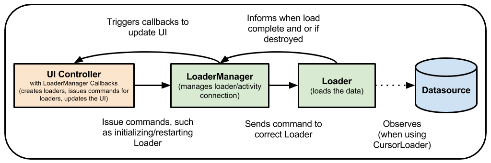

# ViewModel

[`ViewModel`](https://developer.android.google.cn/reference/androidx/lifecycle/ViewModel.html)类旨在以生命周期感知的方式存储和管理与UI相关的数据。ViewModel 类可以让数据在配置更改时不丢失，例如屏幕旋转。

在项目添加生命周期感知组件的依赖，可以参加这个页面：[传送门]( https://developer.android.google.cn/jetpack/androidx/releases/lifecycle )


```groo
  //包含 ViewModel 和 LiveData
    implementation "androidx.lifecycle:lifecycle-extensions:$lifecycle_version"

    // 或者 - 只包含 ViewModel
    implementation "androidx.lifecycle:lifecycle-viewmodel:$lifecycle_version"

    // Kotlin使用 lifecycle-viewmodel-ktx
 //   implementation "androidx.lifecycle:lifecycle-viewmodel-ktx:$lifecycle_version"

    // 或者，只包含 LiveData
    implementation "androidx.lifecycle:lifecycle-livedata:$lifecycle_version"

    // 或者，只有 Lifecycle（没有 LiveData,ViewModel）
    implementation "androidx.lifecycle:lifecycle-runtime:$lifecycle_version"

  // Kotlin 使用 kapt 替代 annotationProcessor
    annotationProcessor "androidx.lifecycle:lifecycle-compiler:$lifecycle_version"


    // 如果使用了 Java8 使用这个替代上面的 lifecycle-compiler
    implementation "androidx.lifecycle:lifecycle-common-java8:$lifecycle_version"

    // 可选 - ReactStreams 对 LiveData 的支持
    implementation "androidx.lifecycle:lifecycle-reactivestreams:$lifecycle_version"

    //Kotlin 使用 lifecycle-reactivestreams-ktx
    implementation "androidx.lifecycle:lifecycle-reactivestreams-ktx:$lifecycle_version"

    // 可选 LiveData 的测试
    testImplementation "androidx.arch.core:core-testing:$lifecycle_version"
```

如果使用的是 Kotlin 记得添加 `kotlin-kapt` 插件


UI 控制器（例如 Activity，Fragment）的生命周期是由 Android 框架管理的。框架可能会因为用户操作或者设备事件等原因销毁或者重建 UI 控制器，这是我们开发者无法控制的。


如果系统销毁或者重建 UI 控制器，那么与 UI 控制器相关的瞬时数据都会丢失。例如，应用的某个 Activity 里可能包含用户列表。当 Activity 因为配置更改而重建，这个新的 Activity 就会去重新拉取用户列表。对于一些简单的数据，activity 可以使用 [onSaveInstanceState()](https://developer.android.google.cn/reference/android/app/Activity.html#onSaveInstanceState(android.os.Bundle)) 存储，再通过 [onCreate()](https://developer.android.google.cn/reference/android/app/Activity.html#onCreate(android.os.Bundle)) 还原，但是此方法仅适用于可以先序列化然后反序列化的少量数据，不适用于潜在的大量数据，例如用户列表或位图。


另一个问题是，UI 控制器经常需要进行异步调用，这可能需要一些时间才能返回。UI 控制器需要管理这些回调，并在被销毁后清除，以避免泄漏。这种管理需要大量维护，并且在重新创建对象以进行配置更改的情况下，这浪费了资源，因为对象可能不得不重新发出已经发出的调用。


UI 控制器 主要是用于显示数据，响应用户操作或者处理与从操作系统的交互，例如权限请求。如果让 UI 控制器去网络或者数据库获取数据，就会很臃肿。这种获取数据的工作应该委托给专门的类去做，UI 控制器有它自己的职责，我们应该尽量让类的职责单一，以方便我们进行测试，也方便管理和维护。


将视图数据从 UI 控制器分离是很容易且有效的。


从UI控制器逻辑中分离出视图数据所有权更容易，更有效。


## 实现 ViewModel

架构组件为 UI 控制器提供了 [`ViewModel`](https://developer.android.google.cn/reference/androidx/lifecycle/ViewModel.html) 类，它的职责就是为 UI 控制器准备数据。 ViewModel 类会在配置更改期间自动保留数据，以便于在 下一个 activity 或者 fragment 创建后马上显示数据。例如，要显示用户列表，应该把数据保存在 ViewModel，而不是 activity 或者 fragment ，如下所示：


Kotlin

```kotlin
class MyViewModel : ViewModel() {
    private val users: MutableLiveData<List<User>> by lazy {
        MutableLiveData().also {
            loadUsers()
        }
    }

    fun getUsers(): LiveData<List<User>> {
        return users
    }

    private fun loadUsers() {
        // 异步获取用户
    }
}
```


Java

```java
public class MyViewModel extends ViewModel {
    private MutableLiveData<List<User>> users;
    public LiveData<List<User>> getUsers() {
        if (users == null) {
            users = new MutableLiveData<List<User>>();
            loadUsers();
        }
        return users;
    }

    private void loadUsers() {
        // 异步获取用户
    }
}
```


然后在 UI 控制器里访问


Kotlin 

```kotlin
class MyActivity : AppCompatActivity() {

    override fun onCreate(savedInstanceState: Bundle?) {
        // 首次调用  onCreate() 时 创建 ViewModel 
        // 重新创建的 activity 时接收的 MyViewModel 实例和首次创建时的是同一个。
        val model = ViewModelProviders.of(this)[MyViewModel::class.java]
        model.getUsers().observe(this, Observer<List<User>>{ users ->
            // 更改 UI
        })
    }
}
```

Java

```java
public class MyActivity extends AppCompatActivity {
    public void onCreate(Bundle savedInstanceState) {
       // 首次调用  onCreate() 时 创建 ViewModel 
        // 重新创建的 activity 时接收的 MyViewModel 实例和首次创建时的是同一个。

        MyViewModel model = ViewModelProviders.of(this).get(MyViewModel.class);
        model.getUsers().observe(this, users -> {
            // 更改 UI
        });
    }
}
```


如果 activity 是重建的，它接收的 MyViewModel 实例是第一次创建的那个。当 activity 被关闭时，框架回调用  ViewModel 的 [`onCleared()`](https://developer.android.google.cn/reference/androidx/lifecycle/ViewModel.html#onCleared()) 方法以清理资源。

> ViewModel 绝不能引用视图，生命周期或任何可能包含对 activity 上下文的引用的类。


ViewModel 对象的设计寿命就比视图或者特定生命周期所有者的实例更长。这意味可以轻易地写测试代码来测试 ViewModel，因为 ViewModel 不知道视图或者生命周期对象。ViewModel 内可以有生命周期观察者 [`LifecycleObservers`](https://developer.android.google.cn/reference/androidx/lifecycle/LifecycleObserver.html) 例如  [`LiveData`](https://developer.android.google.cn/reference/androidx/lifecycle/LiveData.html) 对象，但绝不能观察到可感知生命周期的可观察对象的更改，例如 LiveData 。（通俗点讲：本身是是可以包含可观者对象的，但是不允许观察可感知生命周期的可观察对象。）如果你需要一个 context 去获取系统服务，可以考虑使用 [`AndroidViewModel`](https://developer.android.google.cn/reference/androidx/lifecycle/AndroidViewModel.html) 类，它有一个构造函数接收一个 Application 参数。


## ViewModel 的生命周期


ViewModel 对象的范围是获取 ViewModel 时传递给 [`ViewModelProvider`](https://developer.android.google.cn/reference/androidx/lifecycle/ViewModelProvider.html) 的生命周期。ViewModel 保留在内存中，直到其生命周期范围永久消失：对于 activity 而言，它关闭时，对于 fragment 而言，当它分离时。

下图展示了 activity 经历轮换然后结束的各种生命周期。该图还在关联的 activity 生命周期旁显示了ViewModel 的生命周期。fragment 的生命周期基本上跟这个类似。


通常，在系统第一次调用 activity 对象的 `onCreate()` 方法时，会请求一个 ViewModel 。 在 activity 的整个生命周期中，例如旋转设备屏幕时，系统可能会多次调用 `onCreate() ` 。 从首次请求ViewModel 到 activity 结束并销毁,该 ViewModel 一直存在。


## 在 Fragment 间共享数据

在 Activity 的多个 Fragment 之间彼此通信是很常见的。想象一下主从片段的一种常见情况，有一个片段，用户在其中从列表中选择一个项目，另一个片段显示了所选项目的内容。像这种情况，一般是在 Activity 里定义接口绑定两个 Fragment 实现彼此的通信。此外，两个片段都必须处理另一个片段尚未创建或不可见的情况。


可以通过使用 ViewModel 对象解决这个痛点。这些片段可以使用其 Activity 范围来共享 ViewModel 来处理，如以下示例代码所示：

Kotlin

```kotlin
class SharedViewModel : ViewModel() {
    val selected = MutableLiveData<Item>()

    fun select(item: Item) {
        selected.value = item
    }
}

class MasterFragment : Fragment() {

    private lateinit var itemSelector: Selector

    private lateinit var model: SharedViewModel

    override fun onCreate(savedInstanceState: Bundle?) {
        super.onCreate(savedInstanceState)
        model = activity?.run {
            ViewModelProviders.of(this)[SharedViewModel::class.java]
        } ?: throw Exception("Invalid Activity")
        itemSelector.setOnClickListener { item ->
            // Update the UI
        }
    }
}

class DetailFragment : Fragment() {

    private lateinit var model: SharedViewModel

    override fun onCreate(savedInstanceState: Bundle?) {
        super.onCreate(savedInstanceState)
        model = activity?.run {
            ViewModelProviders.of(this)[SharedViewModel::class.java]
        } ?: throw Exception("Invalid Activity")
        model.selected.observe(this, Observer<Item> { item ->
            // Update the UI
        })
    }
}
```


Java

```java
public class SharedViewModel extends ViewModel {
    private final MutableLiveData<Item> selected = new MutableLiveData<Item>();

    public void select(Item item) {
        selected.setValue(item);
    }

    public LiveData<Item> getSelected() {
        return selected;
    }
}


public class MasterFragment extends Fragment {
    private SharedViewModel model;
    public void onCreate(Bundle savedInstanceState) {
        super.onCreate(savedInstanceState);
        model = ViewModelProviders.of(getActivity()).get(SharedViewModel.class);
        itemSelector.setOnClickListener(item -> {
            model.select(item);
        });
    }
}

public class DetailFragment extends Fragment {
    public void onCreate(Bundle savedInstanceState) {
        super.onCreate(savedInstanceState);
        SharedViewModel model = ViewModelProviders.of(getActivity()).get(SharedViewModel.class);
        model.getSelected().observe(this, { item ->
           // Update the UI.
        });
    }
}
```

注意，两个片段都检索包含它们的 Activity。这样，当每个片段都获得 ViewModelProvider 时，它们将收到相同的 SharedViewModel 实例，该实例的作用范围是此 Activity。


这种方法具有以下优点：

- 该 Activity 不需要执行任何操作，也无需了解此通信。
- 除 SharedViewModel 外，片段不需要彼此了解。如果其中一个碎片消失了，则另一个继续照常工作。
- 每个片段都有自己的生命周期，并且不受另一个片段的生命周期影响。如果一个片段替换了另一个片段，则 UI 可以继续工作而不会出现任何问题。


## 用 ViewModel 替换加载器


诸如 [CursorLoader](https://developer.android.google.cn/reference/android/content/CursorLoader.html) 之类的 Loader 类经常用于使应用程序 UI 中的数据与数据库保持同步。可以使用 ViewModel 和其他一些类来替换加载器。使用 ViewModel 可将 UI 控制器与数据加载操作分开，这意味着在类之间的强引用更少。


在使用加载器的一种常见方法中，应用可能使用 CursorLoader 来观察数据库的内容。当数据库中的值更改时，加载器会自动触发数据的重新加载并更新UI：




ViewModel 使用  [Room](https://developer.android.google.cn/topic/libraries/architecture/room.html) 和 [LiveData](https://developer.android.google.cn/topic/libraries/architecture/livedata.html) 一起替换加载器。ViewModel 确保数据在设备配置更改后仍然存在。当数据库更改时，Room 会通知你的 LiveData，然后 LiveData 会使用修改后的数据更新UI。


## 将协程与ViewModel一起使用

ViewModel包含对Kotlin协程的支持。有关更多信息，请参阅 [将 Kotlin 协程与 Android 体系结构组件一起使用。](https://developer.android.google.cn/topic/libraries/architecture/coroutines)


## 更多信息

随着数据变得越来越复杂，你可能会选择使用单独的类来加载数据。ViewModel 的目的是为UI控制器封装数据，以使数据在配置更改后仍然存在。有关如何在配置更改中加载，保留和管理数据的信息，请参阅 [保存UI状态](https://developer.android.google.cn/topic/libraries/architecture/saving-states.html) 。

[《 Android App Architecture指南》](https://developer.android.google.cn/topic/libraries/architecture/guide.html#fetching_data) 建议构建一个存储库类来处理这些功能。


## 额外资源


有关 ViewModel 类的更多信息，请查阅以下资源。


### 示例

- [Android 架构组件基本示例](https://github.com/googlesamples/android-architecture-components/tree/master/BasicSample)
- [Sunflower](https://github.com/android/sunflower)，一个园艺应用程序，展示了 Android Jetpack 的 Android 开发最佳实践。


### 代码实验室


- [Android生命周期感知组件代码实验室](https://codelabs.developers.google.com/codelabs/android-lifecycles/#0)
- [Android Room with a View](https://codelabs.developers.google.com/codelabs/android-room-with-a-view-kotlin/#0)


### 博客

- [ViewModels : A Simple Example](https://medium.com/androiddevelopers/viewmodels-a-simple-example-ed5ac416317e)
- [ViewModels: Persistence, onSaveInstanceState(), Restoring UI State and Loaders](https://medium.com/androiddevelopers/viewmodels-persistence-onsaveinstancestate-restoring-ui-state-and-loaders-fc7cc4a6c090)
- [ViewModels and LiveData: Patterns + AntiPatterns](https://medium.com/androiddevelopers/viewmodels-and-livedata-patterns-antipatterns-21efaef74a54)
- [Kotlin Demystified: Understanding Shorthand Lambda Syntax](https://medium.com/androiddevelopers/kotlin-demystified-understanding-shorthand-lamba-syntax-74724028dcc5)
- [Kotlin Demystified: Scope functions](https://medium.com/androiddevelopers/kotlin-demystified-scope-functions-57ca522895b1)
- [Kotlin Demystified: When to use custom accessors](https://medium.com/androiddevelopers/kotlin-demystified-when-to-use-custom-accessors-939a6e998899)
- [Lifecycle Aware Data Loading with Architecture Components](https://medium.com/google-developers/lifecycle-aware-data-loading-with-android-architecture-components-f95484159de4)


### 视频

- [Android Jetpack: ViewModel](https://www.youtube.com/watch?v=5qlIPTDE274&t=30s)

  