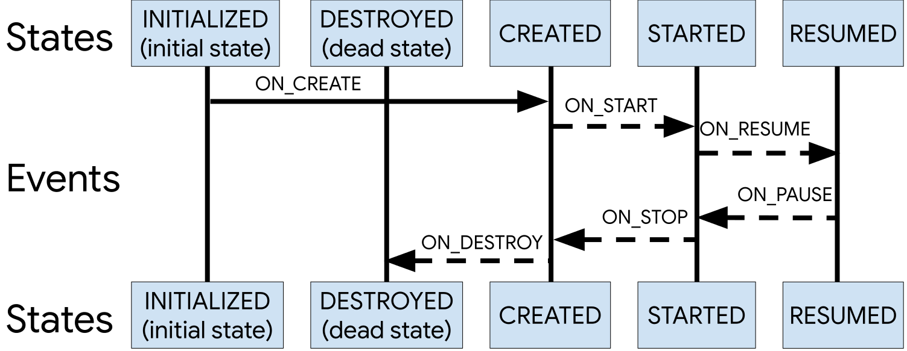

LiveData (点这里)[LiveData.md]

# 生命周期感知组件 Lifecycle


奉上翻译原文地址： [处理生命周期]( https://developer.android.google.cn/topic/libraries/architecture/lifecycle )


生命周期感知组件可以感知其他组件的生命周期，例如 Activity，Fragment等，以便于在组件的生命周期状态变化时做出相应的操作。支持生命感知的组件可以帮你更好的组织代码，让你的代码更轻，更好维护。


对于需要响应生命周期变化的组件，我们通常是在 `Activity` 和 `Fragment`  的生命周期方法里实现一些操作。然而，这种模式会导致代码不好管理，容易出现错误。通过支持生命周期的组件，可以将原本在生命周期方法里的操作移到组件内部。


`androidx.lifecycle` 包提供的接口和类可以帮助我们构建可感知生命周期的组件，这些组件就可以根据 Activity 或者 Fragment 的生命周期状态自行调整行为。


在项目添加生命周期感知组件的依赖，可以参加这个页面：[传送门]( https://developer.android.google.cn/jetpack/androidx/releases/lifecycle )


```groo
  //包含 ViewModel 和 LiveData
    implementation "androidx.lifecycle:lifecycle-extensions:$lifecycle_version"

    // 或者 - 只包含 ViewModel
    implementation "androidx.lifecycle:lifecycle-viewmodel:$lifecycle_version"

    // Kotlin使用 lifecycle-viewmodel-ktx
 //   implementation "androidx.lifecycle:lifecycle-viewmodel-ktx:$lifecycle_version"

    // 或者，只包含 LiveData
    implementation "androidx.lifecycle:lifecycle-livedata:$lifecycle_version"

    // 或者，只有 Lifecycle（没有 LiveData,ViewModel）
    implementation "androidx.lifecycle:lifecycle-runtime:$lifecycle_version"

  // Kotlin 使用 kapt 替代 annotationProcessor
    annotationProcessor "androidx.lifecycle:lifecycle-compiler:$lifecycle_version"


    // 如果使用了 Java8 使用这个替代上面的 lifecycle-compiler
    implementation "androidx.lifecycle:lifecycle-common-java8:$lifecycle_version"

    // 可选 - ReactStreams 对 LiveData 的支持
    implementation "androidx.lifecycle:lifecycle-reactivestreams:$lifecycle_version"

    //Kotlin 使用 lifecycle-reactivestreams-ktx
    implementation "androidx.lifecycle:lifecycle-reactivestreams-ktx:$lifecycle_version"

    // 可选 LiveData 的测试
    testImplementation "androidx.arch.core:core-testing:$lifecycle_version"
```


如果使用的是 Kotlin 记得添加 `kotlin-kapt` 插件


 Android 框架中定义的大多数应用组件都具有生命周期。生命周期是由操作系统或框架代码管理的。

虽然组件的声明周期不由我们控制，但是我们必须尊重组件的生命周期，不然很可能会导致内存泄漏甚至崩溃。


假如我们有个 Activity 在屏幕上显示设备位置信息，最常见的实现可能就是这样了：

Kotlin

```kotlin
internal class MyLocationListener(
        private val context: Context,
        private val callback: (Location) -> Unit
) {

    fun start() {
        // 连接系统位置服务
    }

    fun stop() {
        // 断开系统位置服务
    }
}

class MyActivity : AppCompatActivity() {
    private lateinit var myLocationListener: MyLocationListener

    override fun onCreate(...) {
        myLocationListener = MyLocationListener(this) { location ->
            // 更新 UI
        }
    }

    public override fun onStart() {
        super.onStart()
        myLocationListener.start()
        // 管理其他需要响应 Activity 生命周期的组件
    }

    public override fun onStop() {
        super.onStop()
        myLocationListener.stop()
       // 管理其他需要响应 Activity 生命周期的组件
    }
}
```


Java

```java
class MyLocationListener {
    public MyLocationListener(Context context, Callback callback) {
        // ...
    }

    void start() {
        // 连接系统位置服务
    }

    void stop() {
         // 断开系统位置服务
    }
}

class MyActivity extends AppCompatActivity {
    private MyLocationListener myLocationListener;

    @Override
    public void onCreate(...) {
        myLocationListener = new MyLocationListener(this, (location) -> {
         // 更新 UI
        });
    }

    @Override
    public void onStart() {
        super.onStart();
        myLocationListener.start();
        // 管理其他需要响应 Activity 生命周期的组件
    }

    @Override
    public void onStop() {
        super.onStop();
        myLocationListener.stop();
        // 管理其他需要响应 Activity 生命周期的组件
    }
}
```

目前看起来这样还不错，但在真实情况下，可能还会有其他需要响应生命周期的组件，也有可能是在 `onStart()` 和 `onStop()` 。一个两个还好，如果多了的话把这些都放在生命周期方法里，就比较难以维护。


此外，这并不能保证在 Activity 或者 Fragment 停止之前启动我们的组件。特别是那些需要长期运行的操作，例如在 `onStart()` 里的检查配置操作。这就可能会出现在 `onStart()` 里的操作还未启动，而 `onStop()` 里却要停止的情况。

Kotlin

```kotlin
class MyActivity : AppCompatActivity() {
    private lateinit var myLocationListener: MyLocationListener

    override fun onCreate(...) {
        myLocationListener = MyLocationListener(this) { location ->
            //更新 UI 
        }
    }

    public override fun onStart() {
        super.onStart()
        Util.checkUserStatus { result ->
            // 如果在活动停止后调用此回调该怎么办？
            if (result) {
                myLocationListener.start()
            }
        }
    }

    public override fun onStop() {
        super.onStop()
        myLocationListener.stop()
    }

}
```


Java

```java
class MyActivity extends AppCompatActivity {
    private MyLocationListener myLocationListener;

    public void onCreate(...) {
        myLocationListener = new MyLocationListener(this, location -> {
            // 更新  UI
        });
    }

    @Override
    public void onStart() {
        super.onStart();
        Util.checkUserStatus(result -> {
            // 如果在活动停止后调用此回调该怎么办？
            if (result) {
                myLocationListener.start();
            }
        });
    }

    @Override
    public void onStop() {
        super.onStop();
        myLocationListener.stop();
    }
}
```

` androidx.lifecycle` 包提供了一些类和接口，可帮助你以弹性和隔离的方式解决这些问题。 

## 生命周期

 [`Lifecycle`](https://developer.android.google.cn/reference/androidx/lifecycle/Lifecycle.html)  是一个类，它持有相关组件（例如 Activity 和 Fragment）的生命周期状态信息并且可以让其他对象观察到这个状态。

`Lifecycle` 使用两个主要枚举来跟踪相关组件的生命周期状态。


**Event**

`Android` 框架和 `lifecycle` 类发出的生命周期事件。它对应到 Activity 和 fragment 里的生命周期回调。

**State**

`Lifecycle` 类跟踪的相关组件的当前生命周期状态。





类可以通过添加注解来侦听组件的生命周期事件。通过调用 `Lifecycle` 的 `addObserver()` 方法传递进去一个你的观察对象即可，如下所示：

Kotlin

```kotlin
class MyObserver : LifecycleObserver {

    @OnLifecycleEvent(Lifecycle.Event.ON_RESUME)
    fun connectListener() {
        ...
    }

    @OnLifecycleEvent(Lifecycle.Event.ON_PAUSE)
    fun disconnectListener() {
        ...
    }
}

myLifecycleOwner.getLifecycle().addObserver(MyObserver())
```

Java

```java
public class MyObserver implements LifecycleObserver {
    @OnLifecycleEvent(Lifecycle.Event.ON_RESUME)
    public void connectListener() {
        ...
    }

    @OnLifecycleEvent(Lifecycle.Event.ON_PAUSE)
    public void disconnectListener() {
        ...
    }
}

myLifecycleOwner.getLifecycle().addObserver(new MyObserver());
```

这个示例中，`myLifecycleOwner` 实现了 `LifecycleOwner` 接口。


## 生命周期所有者


 [`LifecycleOwner`](https://developer.android.google.cn/reference/androidx/lifecycle/LifecycleOwner.html)  是一个单方法的接口，它表示这个类有生命周期。它有一个类必须实现的方法：  [`getLifecycle()`](https://developer.android.google.cn/reference/androidx/lifecycle/LifecycleOwner.html#getLifecycle())   。如果你想管理整个应用进程的生命周期可以看看这个  [`ProcessLifecycleOwner`](https://developer.android.google.cn/reference/androidx/lifecycle/ProcessLifecycleOwner.html) 

 

这个接口从单个类中抽象出生命周期的所有权，例如 Activity 和 Fragment，可以与你写的组件共享生命周期。任何类都可以实现 `LifecycleOwner` 接口。

 实现 `LifecycleObserver` 的组件与实现 `LifecycleOwner` 的组件可以无缝地衔接，因为所有者可以提供生命周期，观察者可以注册该生命周期以观察。 


对于上面显示位置的例子，就可以让 ` MyLocationListener`   实现 `LifecycleObserver` ，并在 `Activity` 的生命周期方法 `onCreate()` 里初始化。这样的话 `MyLocationListener`  类就可以自给自足，在自己本身内部实现响应生命周期变化的逻辑处理。每个组件都在自己内部响应生命周期变化就让 `Activity` 和 `Fragment` 的逻辑变得很清晰。


Kotlin

```kotlin
class MyActivity : AppCompatActivity() {
    private lateinit var myLocationListener: MyLocationListener

    override fun onCreate(...) {
        myLocationListener = MyLocationListener(this, lifecycle) { location ->
            // 更新 UI
        }
        Util.checkUserStatus { result ->
            if (result) {
                myLocationListener.enable()
            }
        }
    }
}
```


Java

```java
class MyActivity extends AppCompatActivity {
    private MyLocationListener myLocationListener;

    public void onCreate(...) {
        myLocationListener = new MyLocationListener(this, getLifecycle(), location -> {
            // 更新 UI
        });
        Util.checkUserStatus(result -> {
            if (result) {
                myLocationListener.enable();
            }
        });
  }
}
```

 一个常见的用例是，如果生命周期当前状态不佳，则避免调用某些回调。  例如，如果回调在保存活动状态后运行 `Fragment` 事务，那么它将触发崩溃，因此我们永远都不想调用该回调。 

 

为了简化此用例，`Lifecycle` 类允许其他对象查询当前状态。 通过方法: [Lifecycle.State.isAtLeast()]( https://developer.android.google.cn/reference/androidx/lifecycle/Lifecycle.State.html#isAtLeast(androidx.lifecycle.Lifecycle.State) )


Kotlin

```kotlin
internal class MyLocationListener(
        private val context: Context,
        private val lifecycle: Lifecycle,
        private val callback: (Location) -> Unit
) {

    private var enabled = false

    @OnLifecycleEvent(Lifecycle.Event.ON_START)
    fun start() {
        if (enabled) {
            // 连接
        }
    }

    fun enable() {
        enabled = true
        if (lifecycle.currentState.isAtLeast(Lifecycle.State.STARTED)) {
            // 如果还没连接，就去连接
        }
    }

    @OnLifecycleEvent(Lifecycle.Event.ON_STOP)
    fun stop() {
        // 如果连接了就断开
    }
}
```


Java

```java
class MyLocationListener implements LifecycleObserver {
    private boolean enabled = false;
    public MyLocationListener(Context context, Lifecycle lifecycle, Callback callback) {
       ...
    }

    @OnLifecycleEvent(Lifecycle.Event.ON_START)
    void start() {
        if (enabled) {
           // 连接
        }
    }

    public void enable() {
        enabled = true;
        if (lifecycle.getCurrentState().isAtLeast(STARTED)) {
            // 如果还没连接，就去连接
        }
    }

    @OnLifecycleEvent(Lifecycle.Event.ON_STOP)
    void stop() {
        // 如果连接了就断开
    }
}
```

通过以上实现，我们的 `LocationListener` 已经具备了感知生命周期的能力并且可以做出相应的操作。如果其他的 `Activity` 或者 `Fragment` 想使用它，只需要初始化它即可。其他所有操作都由 `LocationListener` 自己处理。


 如果你的库提供了需要与 Android 生命周期一起使用的类，则建议使用可识别生命周期的组件。 你的库可以轻松集成这些组件，而无需在客户端进行手动生命周期管理。 


### 自定义生命周期所有者

 支持库 26.1.0 以及更高版本中的 `Fragment` 和 `Activity` 已经实现了  [`LifecycleOwner`](https://developer.android.google.cn/reference/androidx/lifecycle/LifecycleOwner.html)  接口。 

 如果想要创建 `LifecycleOwner` 的自定义类，则可以使用  [`LifecycleOwner`](https://developer.android.google.cn/reference/androidx/lifecycle/LifecycleOwner.html)  类，但是需要将事件转发到该类中，如以下代码示例所示： 

Kotlin

```kotlin
class MyActivity : Activity(), LifecycleOwner {

    private lateinit var lifecycleRegistry: LifecycleRegistry

    override fun onCreate(savedInstanceState: Bundle?) {
        super.onCreate(savedInstanceState)

        lifecycleRegistry = LifecycleRegistry(this)
        lifecycleRegistry.markState(Lifecycle.State.CREATED)
    }

    public override fun onStart() {
        super.onStart()
        lifecycleRegistry.markState(Lifecycle.State.STARTED)
    }

    override fun getLifecycle(): Lifecycle {
        return lifecycleRegistry
    }
}
```


Java

```java
public class MyActivity extends Activity implements LifecycleOwner {
    private LifecycleRegistry lifecycleRegistry;

    @Override
    protected void onCreate(Bundle savedInstanceState) {
        super.onCreate(savedInstanceState);

        lifecycleRegistry = new LifecycleRegistry(this);
        lifecycleRegistry.markState(Lifecycle.State.CREATED);
    }

    @Override
    public void onStart() {
        super.onStart();
        lifecycleRegistry.markState(Lifecycle.State.STARTED);
    }

    @NonNull
    @Override
    public Lifecycle getLifecycle() {
        return lifecycleRegistry;
    }
}
```

 ## 生命周期感知组件的最佳实践 


- 尽可能的让 UI 控制器（Activity 和 Fragment） 保持精简。让 ViewModel 去获取数据，数据更改通过 LiveData 响应到视图。
- 尝试编写数据驱动的 UI ，其中 UI 控制器的职责是在数据更改时更新视图，或者将用户操作通知给 ViewModel 。
- 将数据业务逻辑放在 ViewModel 类。ViewModel 类的定位应该是 UI 控制器和应用中其他部分的连接器。但并不是说让 ViewModel 类去获取数据，相反的应该让其他合适的组件去获取数据，ViewModel 类只是把结果提供给 UI 控制器。
- 使用数据绑定库维护视图和 UI 控制器的整洁。这让视图更具声明性，并减少在 UI 控制器的更新代码。如果你倾向于使用 Java ，可以使用  [Butter Knife](http://jakewharton.github.io/butterknife/)   减少重复代码。
- 如果 UI 过于复杂，可以考试创建一个 Presenter 类管理 UI 更新，这可能更麻烦，但是可以更好的管理 UI 。
- 避免在 ViewModel 引用 View和 Activity 上下文。如果 ViewModel 生命超过 Activity （配置发生更改的情况下）可能会造成 Activity 泄漏，并且不被垃圾处理器回收。
-  使用 Kotlin 协程来管理长时间运行的任务以及可以异步运行的其他操作。 


 ##  生命周期感知组件的用例 


生命周期感知组件可以让你在各种情况下都很好的管理生命周期，例如：

-  在粗略和细粒度的位置更新之间切换。 使用生命周期感知组件在应用可见时启用细粒度的位置更新，在应用处于后台时切换到粗粒度的更新。
- 停止和开启视频缓冲。 使用支持生命周期的组件尽快开始视频缓冲，但是将播放推迟到应用程序完全启动。 还可以使用可识别生命周期的组件在应用程序销毁时终止缓冲。 
-  启动和停止网络连接。  使用可感知生命周期的组件可以在应用程序处于前台状态时实时更新（流式传输）网络数据，并在应用程序进入后台时自动暂停。 
-  暂停和恢复动画绘制。  当应用程序在后台运行时，使用生命周期感知组件处理暂停动画绘制，并在应用程序在前台运行后恢复绘制。 


## 处理停止事件


当生命周期属于 `AppCompatActivity` 或 `Fragment` 时，生命周期的状态更改为 `CREATED` ，并且在调用 `AppCompatActivity` 或 `Fragment` 的 `onSaveInstanceState（）` 时调度 `ON_STOP` 事件。 


 当通过 `onSaveInstanceState（）` 保存 `Fragment` 或 `AppCompatActivity` 的状态时，在调用 `ON_START` 之前，它的 UI 被认为是不可变的。  保存状态后尝试修改 UI 可能会导致应用程序的导航状态不一致，这就是为什么如果状态保存后应用程序运行 `FragmentTransaction` ，则 `FragmentManager` 会引发异常的原因。 详情参见： [commit()](https://developer.android.google.cn/reference/androidx/fragment/app/FragmentTransaction.html#commit()) 


 如果观察者的关联生命周期至少不是 `STARTED`， `LiveData` 不会调用观察者，从而避免了这种极端情况。  在幕后，它在决定调用其观察者之前调用 `isAtLeast（）` 判断当前状态。 


不幸的是，在 `onSaveInstanceState（）` 之后调用了 `AppCompatActivity ` 的 `onStop（）` 方法，这留下了一个空白，在该空白中，不允许 UI 状态更改，但生命周期尚未移至 `CREATED` 状态。 

 

为避免此问题，版本 `beta2` 及更低版本中的 `Lifecycle` 类将状态标记为 `CREATED` 而不调度事件，因此，即使直到系统调用了 `onStop（）` 才调度事件，任何检查当前状态的代码都将获得真实值。


 不幸的是，此解决方案有两个主要问题： 

-  在 API 级别 23 和更低级别上，Android 系统实际上会保存 `Activity` 的状态，即使该 `Activity` 已被另一个 `Activity` 部分覆盖 。 换句话说，Android 系统调用 `onSaveInstanceState（）` ，但不一定调用 `onStop（）` 。  这将创建一个可能较长的时间间隔，在该时间间隔中，即使无法修改其 UI 状态，观察者仍认为生命周期处于活动状态。 
-  任何要向 `LiveData`  类公开类似行为的类都必须实现 `Lifecycle`  beta 2 及更低版本提供的解决方法。 


>  **注意：** 为了简化流程并提供与旧版本的更好兼容性，从版本 1.0.0-rc1 开始，生命周期对象被标记为`CREATED` ，并且在调用 `onSaveInstanceState（）` 时分派 `ON_STOP` ，而无需等待对 `onStop（）` 的调用。  这不太可能影响你的代码，但是需要注意这一点，因为它与 API 级别 26 及更低级别的 `Activity` 类中的调用顺序不匹配。 


参考资料

 [Lifecycle（使用篇）](https://juejin.im/post/5db27753518825648f2ef5c9 )

---
